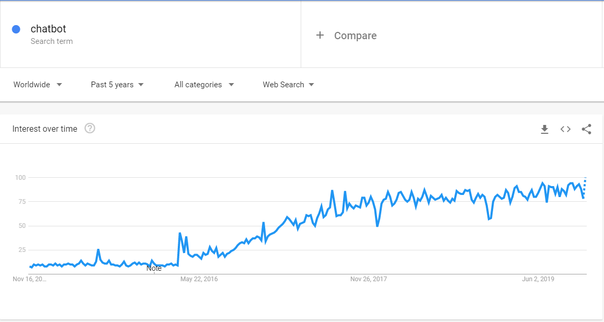
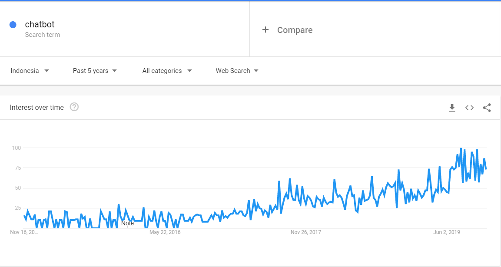
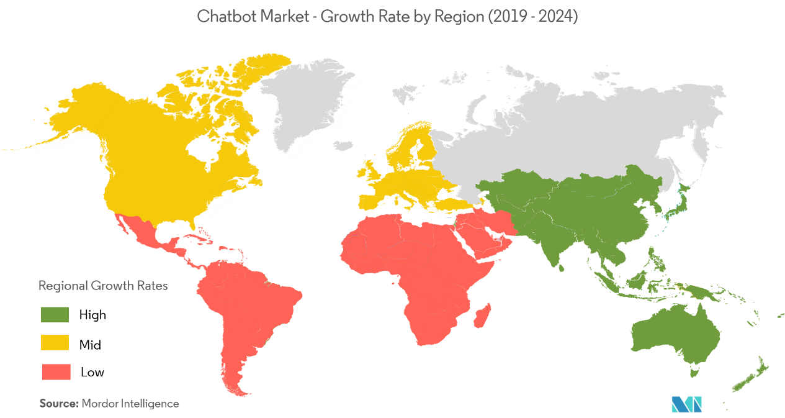
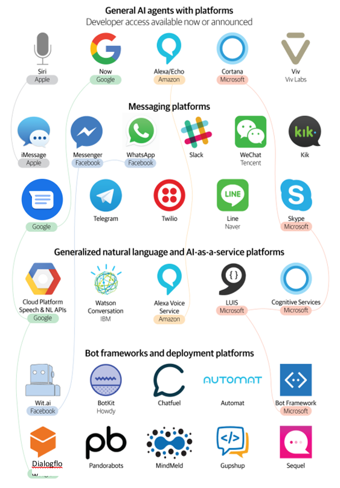
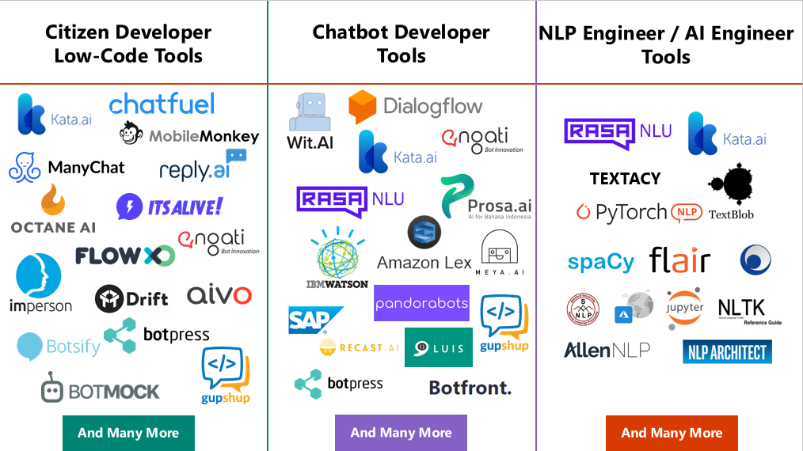
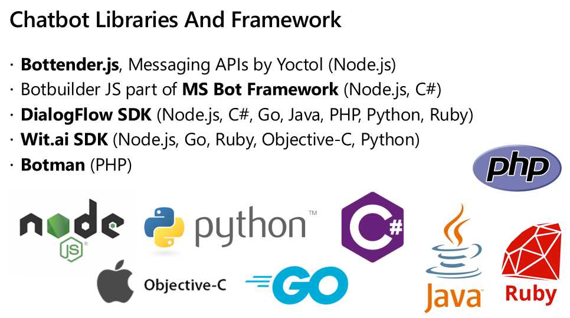
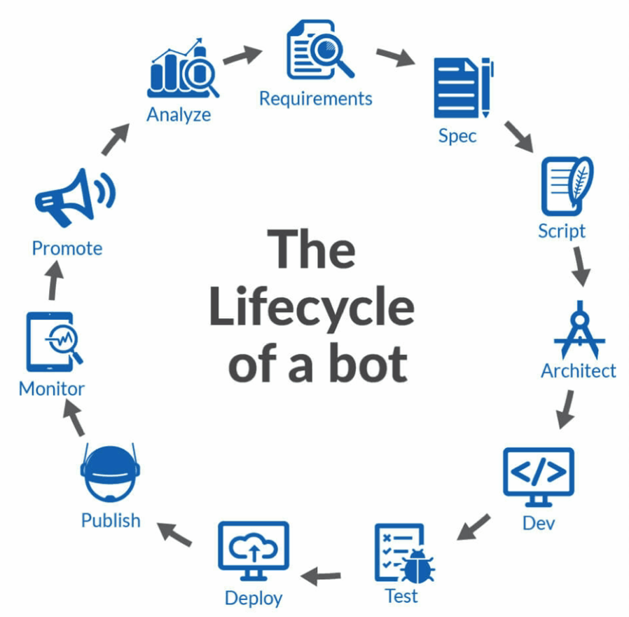

## Ekosistem Chatbot

*Gambar-1.12 Grafik Google Trend Chatbot di Dunia*

Perhatikan trend keyword chatbot di dunia, dari tahun ke tahun meningkat dapat dilihat dari grafik berikut. Ini adalah fakta, bahwa perkembangan dan minat terhadap chatbot telah meningkat dari tahun ke tahun. Lalu bagaimana dengan trend di Indonesia, mari kita lihat grafik berikut ini.

*Gambar-1.13 Grafik Google Trend Chatbot di Indonesia*

Di Indonesia pun, tren chatbot semakin meningkat setiap tahunnya. Diikuti dengan bertambahnya perusahaan pengembang platform chatbot di Indonesia. Hal tersebut merupakan fakta yang dapat dijadikan acuan bahwa ekosistem chatbot akan semakin ramai dikemudian hari.

*Gambar-1.14 Peta pertumbuhan market chatbo di dunia*

Yang berwarna hijau merupakan area dengan pertumbuhan paling tinggi. Dapat dilihat disini Asia merupakan market terbesar untuk chatbot. Lalu yang berwarna kuning, merupakan area dengan pertumbuhan yang cukup tinggi, Dan yang berwarna merah, merupakan area dengan pertumbuhan yang rendah.
Artinya apa? kita berada di wilayah Asia betul? dan ini merupakan momentum yang baik bagi Anda seorang developer untuk mulai berinvestasi meningkatkan kemampuan dan pengetahuan di dunia chatbot.

*Gambar-1.15 Ekosistem Platform Chatbot*

Sekarang mari perhatikan ekosistem chatbot yang melibatkan perusahaan-perusahaan raksasa dunia. Ada Apple, Google, Amazon, Microsoft, dan Viv Labs dari Samsung
Kemudian ada platform messaging, yaitu iMessage, Messenger, WhatsApp, Slack dan lain sebagainya. Dimana beberapa platform messaging dimiliki oleh perusahaan besar tersebut.
Lalu ada beberapa teknologi Natural Language Processing yang dapat dipakai oleh developer, karena sudah berbasis API.
Dan yang terakhir ada bot framework, dan beberapa bot framework memanfaatkan layanan Natural Language Processing yang sudah ada seperti dialogflow menggunakan NLP Google dan Botframework menggunakan LUIS defaultnya.
Dari sini dapat dilihat bahwa ekosistem chatbot sudah cukup lengkap. Dan chatbot developer bisa dengan mudah memanfaatkan semua teknologi tersebut untuk memenuhi kebutuhan pengguna atau konsumen.

*Gambar-1.16 Perkakas Chatbot*

Dan sekarang kita akan melihat bagaimana tools pengembangan chatbot dari 3 perspective pengguna toolsnya, yaitu Citizen Developer, Chatbot Developer dan NLP Engineer / AI Engineer.

Citizen Developer adalah istilah yang digunakan untuk pengguna teknologi yang bukan dari kalangan developer. Melainkan hanya pengguna teknologi namun dapat membuat solusi chatbot dengan adanya tools drag and drop yang mudah digunakan.

Digambar diatas dapat dilihat berbagai macam tools yang disediakan berbagai perusahaan di dunia, seperti chatfuel, manychat, dan lain sebagainya. Ada baiknya Anda sebagai chatbot developer memiliki pengalaman dalam menggunakan satu atau dua tools tersebut, untuk menambah wawasan dan perspective.

Lalu ada chatbot developer tools, disini sudah jelas, bahwa sebagai developer kita harus memiliki skill dan pengetahuan diberbagai macam tools agar tidak vendor locking.

Dan yang ketiga ada NLP Engineer atau AI engineer tools. Beberapa tools dapat digunakan untuk beberapa tipe pengguna, artinya perusahaan tersebut menjangkau segmen developer dan non-developer sebagai pengguna platformnya.
Dari penjelasan tersebut, Anda bisa perhatikan bahwa banyak pilihan yang bisa Anda gunakan ketika mengembangkan chatbot. Dengan mengetahui berbagai macam tools tersebut, Anda akan menjadi lebih bijaksana dalam membuat keputusan. Sehingga Anda dapat bekerja lebih efektif dan efisien.
Dapat dilihat pada gambar berikut, Chatbot dapat diimplementasikan pada berbagai macam bisnis.

Kalau bicara website, saat ini hampir semua orang tau website, Dan dalam dunia Digital Marketing biasanya lebih akrab disebut Landing Page. Dan di masa mendatang, sekitar 3 tahun kedepan, chatbot akan menjadi salah satu channel distribusi yang umum dalam dunia Digital Marketing.  Ibaratnya kalau sekarang, apa-apa minta dibuatkan website atau landing page. Nanti dikemudian hari, apa-apa minta dibuatkan chatbotnya.
Faktanya, sudah ada belasan perusahaan di Indonesia yang berinvestasi mengembangkan platform chatbot / conversational AI.

## Pustaka Dan Kerangka Kerja Chatbot

Tidak lengkap rasanya jika tidak ada framework atau library yang dibahas dalam suatu ekosistem teknologi

*Gambar-1.15 Ekosistem Platform Chatbot*

Untuk membuat chatbot dari scratch Anda bisa pakai framework open-source bottender.js. Bottender dibuat oleh developer asal Taiwan yang bekerja diperusahaan AI bernama Yoctol. Menurut saya framework ini mudah digunakan dan simple. Dan juga memiliki dokumentasi yang bagus serta contoh penggunaan yang banyak. Selain itu, Anda juga bisa menggunakan framework bot dari Microsoft. Ini juga bagus, simple, dokumentasinya lengkap dan contohnya juga banyak.
Lalu ada SDK dialogflow, kalau pakai SDK tentunya akan vendor locking ya, jadi tidak fleksibel ketika ingin menggunakan NLP engine selain dialogflow. Kecuali memang akan menggunakan dialogflow dalam jangka Panjang. Begitu juga dengan SDK dari Wit.ai sama halnya dengan SDK dialogflow. Dan yang terakhir ada Botman. Dokumentasinya bagus, ada online coursenya, supportnya juga bagus.
Framework dan library yang saya sebutkan disini adalah yang memiliki kriteria project aktif, dokumentasinya bagus, contoh penggunaanya banyak dan mudah digunakan. Jika diperhatikan hampir semua library atau framework mendukung NodeJs. Karena JavaScript adalah Bahasa pemograman yang bisa digunakan untuk membangun berbagai macam jenis aplikasi seperti desktop, web, mobile apps, serta mendukung berbagai macam sistem operasi, sehingga dianggap lebih mudah untuk di adopsi bagi para pengembang perangkat lunak khususnya pengembang chatbot.

## Siklus Hidup Pengembangan Chatbot

*Gambar-1.19 Siklus Pengembangan Chatbot*

Layaknya seperti pengembangan perangkat lunak pada umumnya yang memiliki siklus hidup pengembangan. Chatbot pun memiliki hal yang serupa.

Berikut ini adalah penjelasan singkat untuk masing-masing tahapan tersebut:

1. Requirements
    - Mendefinisikan kebutuhan pasar atau konsumen
    - Membuat user stories dengan mindset percakapan

2. Spec
    - Identifikasi fitur dan fungsi dari bot
    - Memilih platform berbagi pesan, seperti Facebook Messenger, Line Messenger, Telegram, WhatsApp, dan lain-lain
    - Menentukan apakah akan menggunakan Natural Language Processing atau cukup dengan Rule-Based

3. Script
    - Percakapan adalah antarmukanya (Conversational User Interface)
    - Dapatkan masukan dari calon pengguna chatbot, seperti argument apa saja yang akan diberikan
    - Membuat respon pesan yang berkarakter, ramah dan dapat memandu pengguna agar tidak bingung ketika berinteraksi dengan chatbot
    - Menyiapkan scriptwriters seperti percakapan atau dialog dalam suatu film

4. Architect
    - Desain sistem chatbot, menentukan arsitektur sistem chatbot dan teknologi yang akan digunakan untuk mengembangkan chatbot
    - Menentukan jenis penyimpanan data yang persistent atau di memori untuk menyimpan data seperti preferensi atau personafikasi

5. Dev
    - Implementasi spesifikasi chatbot yang telah didefinisikan sebelumnya dengan mengikuti arsitektur yang sudah ditentukan
    - Membuat chatbot menggunakan perangkat seperti Code Editor atau perangkat lainnya yang dapat meningkatkan produktifitas pengembangan chatbot, contohnya seperti Line Designer

6. Test
    - Menguji percakapan dengan berbagai macam variasi argument
    - Menguji respon atau jawaban dari chatbot
    - Menggunakan perangkat seperti Botium atau QBox untuk melakukan automated testing

7. Deploy
    - Mendeploy source code chatbot ke on-premise server atau ke cloud server
    - Server harus memiliki monitoring dan dukungan pengetahuan DevOps Engineer jika server dikelola sendiri

8. Publish
    - Publikasi chatbot ke platform berbagi pesan. Misalnya ke Facebook Messenger, perhatikan proses approval masing-masing platform. Karena yang paling lama proses persetujuannya adalah platform Facebook
    - Publikasi chatbot yang paling cepat adalah ke channel Telegram

9. Monitor
    - Percakapan harus dimonitor agar dapat di evaluasi dan dikembangkan lebih lanjut
    - Karena bisa jadi beberapa respon percakapan bisa terasa lebih lambat ketika beban server chatbot sedang tinggi, hal ini tentunya perlu di monitor lebih lanjut untuk menjaga kualitas dari percakapan

10. Promote
    - Promosi chatbot dapat dilakukan melalui iklan
    - Promosi melalui click to chat pada suatu website juga bisa efektif digunakan
    - Atau gunakan program referral pihak ketiga untuk mempromosikan chatbot Anda secara lebih luas

11. Analyze

    - Setelah melalui berbagai macam proses, data percakapan yang terekam di sistem dapat di Analisa guna meningkatkan kualitas chatbot kedepannya
    - Data-data seperti lokasi, jenis kelamin dapat berguna untuk melakukan segmentasi target market
    - Serta dapat menganalisa sentiment negative dari suatu percakapan
