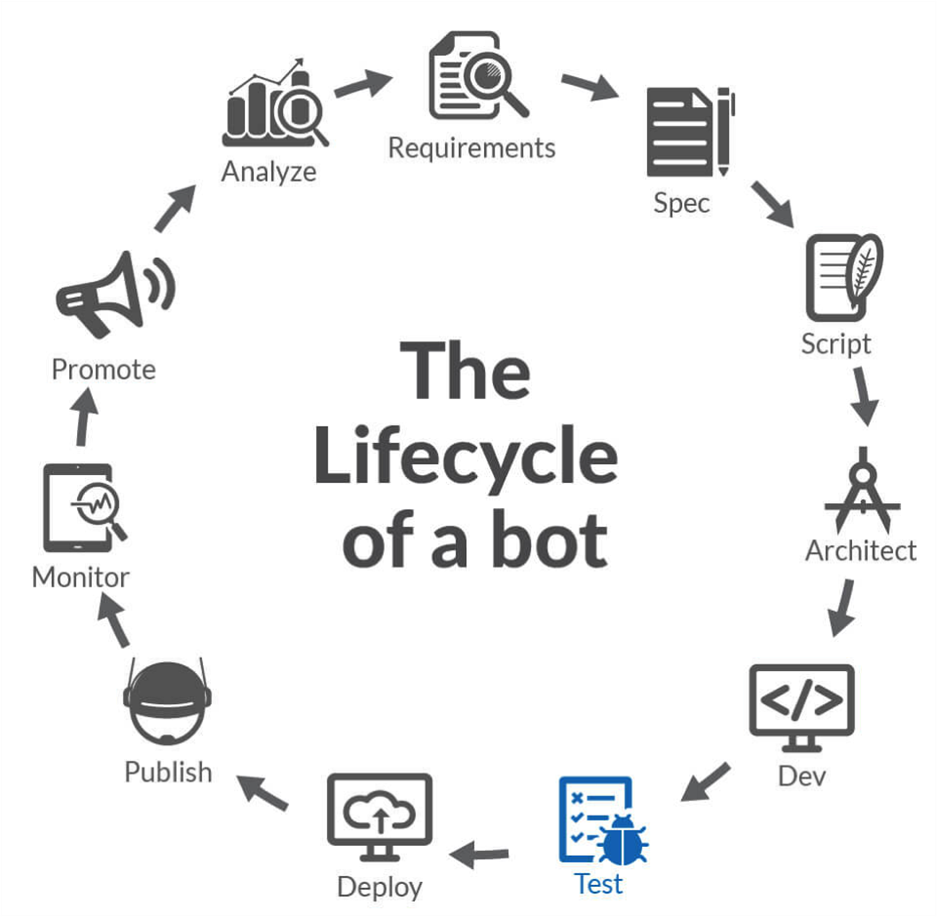
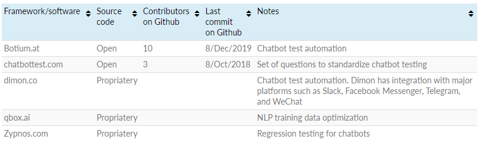

## Berbagai Macam Alat Pengujian Chatbot

Pengujian chatbot adalah bagian dari siklus hidup pengembangan software,
dan jangan lupa bahwa chatbot itu adalah software atau perangkat lunak juga.

*Gambar-1.33 Tahap Pengujian Chatbot*

Ketika melakukan pengujian chatbot, pastikan diuji sesuai dengan dimana chatbot tersebut dapat diakses. Contohnya di Facebook Messenger, Telegram, Line Messenger, atau jika hanya di Facebook, tentunya pengujian chatbot dapat lebih focus ke satu platform saja. Untuk masing-masing channel pasti akan terdapat perbedaan tampilan pesan, terutama pesan yang menggunakan list atau tombol.
Ada beberapa tools yang saat ini cukup dikenal. Botium dan chatbottest merupakan teknologi open-source sedangkan yang lainnya closed-source. Dapat dilihat ditabel berikut ini:

*Gambar-1.34 Chatbot Testing Tools*

Sumber:
[https://blog.aimultiple.com/chatbot-testing-frameworks/](https://blog.aimultiple.com/chatbot-testing-frameworks/)

### Botium

Apa saja yang bisa dilakukan oleh botium?
Botium memiliki predefined datasets yang bisa kita gunakan untuk menguji chatbot dan sudah mendukung Bahasa Indonesia. Botium akan membantu melakukan testing di level API sampai ke user interface atau simulasi chatting. Dan juga mendukung integration untuk CI/CD pipeline.

### Chatbottest

Chatbottest focus kepada aspek desain chatbot, yang mana ini akan sangat membantu untuk meningkatkan kualitas dari desain chatbot yang kita buat. Tentunya berbeda dengan botium yang menguji chatbot dari sisi teknis API. 
Pengujian menggunakan tools chatbottest lebih mengedepankan interaksi secara manual. Chatbottest ini memiliki daftar pertanyaan yang dikelompokan dalam 7 kategori, yaitu

#### Personality

Pertanyaan pertanyaan pada kategori Personality, dapat memberikan masukan kepada chatbot developer terkait dengan kejelasan percakapan yang dimiliki oleh chatbot, seperti tone suaranya apakah mudah dipahami atau dapat didengar dengan jelas

#### Onboarding

Hasil dari kategori ini dapat memberikan masukan tentang seberapa pahamkan user dengan chatbot dan bagaimana interaksinya dari mulai pertama kali memulai percakapan

#### Understanding

Lalu ada kategori Understanding, yang melihat beberapa hal, seperti apakah chatbot mengerti percakapan sehari-hari, basa-basi atau beberapa istilah, serta emoji

#### Answering

Kategori Answering, melihat bagaimana chatbot memberikan respon selain teks, misalnya berupa button, slide gambar, atau yang lainnya, dan apakah respon-respon tersebut relevan dengan percakapanya

#### Navigation

Kemudian kategori navigasi, tentang semudah apa untuk melakukan percakapan dengan chatbot, apakah lawan bicara merasa kebingungan ketika berinteraksi dengan chatbot?

#### Error management

Lalu ada kategori error management, disini dilihat seberapa baikkah chatbot mengatasi percakapan yang error atau diluar scope kemampuan chatbot, dan bagaimana chatbot dapat meluruskan kembali percakapannya.

#### Intelligence

Yang terakhir ada intelligence, disini chatbot diuji kecerdasannya. Misalnya dapat mengingat konteks pembicaraan sebelumnya dan menggunakan konteks dalam percakapan dari satu topik ke topik yang lainnya

Chatbotest menyediakan chrome extension yang bernama Alma, yang bisa digunakan ketika menguji chatbot side-by-side. Dengan panduan 7 kategori yang sebelumnya sudah dijelaskan.

### Zypnos

Ada Zypnos, yang saat ini masih beta, Tidak banyak yang bisa dicoba, karena ketika saya daftar dan masuk ke dalam sistemnya, terlihat belum siap untuk digunakan.

### Qbox

Dari beberapa tools yang dijelaskan tadi, untuk saat ini yang bisa digunakan adalah Alma dari Chatbottest, botium dan Qbox.ai.
Qbox.ai ini menggunakan metode yang berbeda disbanding dengan tools yang lainnya. Karena Qbox.ai akan melalakukan Analisa terhadap dataset yang digunakan sebelum menguji chatbot. Karena fokusnya qbox.ai adalah mengoptimasi data training yang kita miliki. Dengan menunjukan hasil dalam bentuk grafik dan rangkuman table yang bisa digunakan sebagai acuan untuk meningkatkan kualitas dari data training chatbot.

## Kesimpulan Alat Pengujian Chatbot

1. Alma Chatbottest dapat digunakan untuk menguji desain chatbot
2. Botium dapat digunakan untuk menguji respon chatbot dengan berbagai macam Bahasa, dapat di install on-premise dan diintegrasikan dengan CI/CD
3. Qbox.ai dapat digunakan untuk menguji data training chatbot dan menguji kualitas respon dari chatbot untuk beberapa provider NLP
